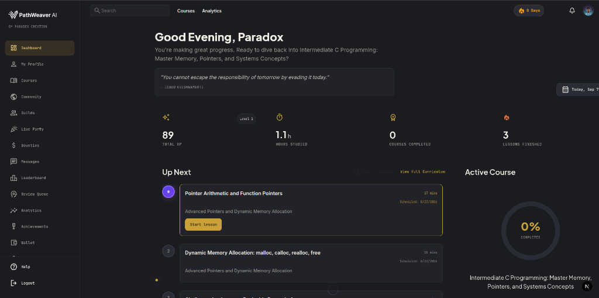
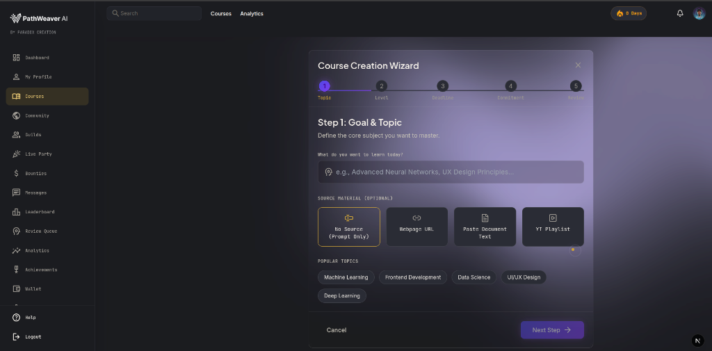
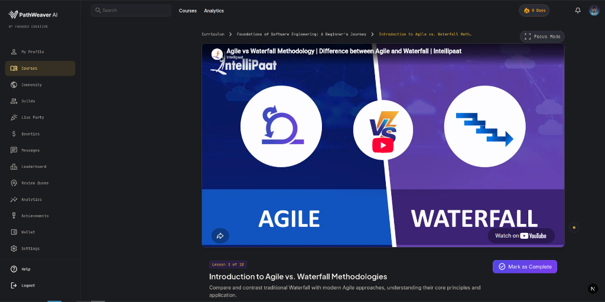
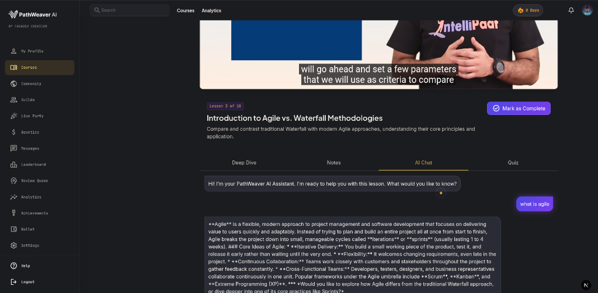
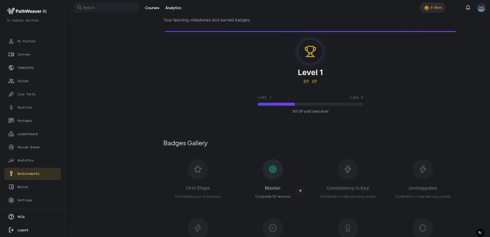

# PathWeaver AI 🎓⚡

<div align="center">



### **Personalized, Adaptive Curriculum Platform with Multi-Factor Educational Video Discovery & Collaborative Learning**

[](https://nextjs.org/)
[](https://react.dev/)
[](https://www.typescriptlang.org/)
[](https://tailwindcss.com/)
[](https://www.prisma.io/)
[](https://www.postgresql.org/)
[](https://redis.io/)
[](https://vitest.dev/)

</div>

---

## 📖 Overview

**PathWeaver AI** transforms open-ended learning goals and fragmented web resources into structured, adaptive, interactive curricula. Unlike static course catalogs or raw video playlists, PathWeaver acts as an **autonomous instructional architect**—discovering high-yield educational videos across multiple pedagogical intents, verifying transcript instructional density, compiling deep dive notes, and orchestrating daily study schedules with spaced repetition.

Whether studying systems programming, machine learning, or creative disciplines, PathWeaver dynamically adapts to your pace, reinforces mastery through interactive assessments and coding challenges, and connects you with peers through synchronized watch parties and study guilds.

---

## 📸 Product Tour

### 1. 📊 Learner Dashboard & Study Velocity
Track active courses, upcoming scheduled sessions, weekly learning velocity, total XP, and daily streaks in a focused command center.

<p align="center">
  
</p>

### 2. 🪄 Intelligent Course Creation Wizard
Scaffold structured curricula from high-level topics, articles, raw text, or existing YouTube playlists with fine-tuned control over learner difficulty, daily time commitment, and target deadlines.

<p align="center">
  
</p>

### 3. 🎥 Distraction-Free Lesson Workspace
Focus on video content paired with chapter context, synchronized transcript notes, interactive tabs, and one-click completion.

<p align="center">
  
</p>

### 4. 🤖 In-Lesson Interactive AI Tutor
Clear doubts on the fly with a dedicated AI assistant directly inside your active lesson workspace, grounded in the current topic's curriculum and transcript context.

<p align="center">
  
</p>

### 5. 🏆 Gamification & Milestone Badges
Stay motivated with level progression, daily streak tracking, XP awards for quiz completion, and unlockable achievement badges.

<p align="center">
  
</p>

---

## 🚀 Key Features

### 🧠 Pedagogical Curriculum Architecture
- **Adaptive Structuring:** Generates module hierarchies with measurable Bloom's taxonomy action objectives and clear prerequisites.
- **Multi-Factor Video Discovery Pipeline:**
  - **Multi-Intent Fanout:** Fires distinct search queries (`beginner_explainer`, `practical_applied`, `concept_deep_dive`, `comparison_troubleshooting`, `visual_alternative`).
  - **Metadata Pre-Filtering:** Filters out YouTube Shorts, clips exceeding duration thresholds, and outdated volatile content.
  - **Deterministic Candidate Ranking:** 5-factor scoring model balancing keyword relevance (30%), recency (10%), engagement (10%), channel diversity (15%), and duration fit (10%).
  - **Transcript Verification:** Fetches and inspects captions for depth, density, and pedagogical alignment.
  - **Instructional Quality Gates:** Automates lesson coverage checks with targeted fallback search strategies and remediation passes.

### 💻 Interactive Learning Workspace
- **Deep Dive Notes:** Synchronized markdown reading material compiled for each topic.
- **Monaco Code Challenges:** In-browser programming challenges with client-side execution for JavaScript/TypeScript.
- **Assessment Engine:** Multi-question comprehension quizzes that record mastery and feed the spaced repetition scheduler.
- **Spaced Repetition & Calendaring:** SM-2 spaced repetition tracking and dynamic calendar schedule balancing.

### 👥 Social & Collaborative Learning
- **Live Watch Parties:** Real-time synchronized video playback using Server-Sent Events (SSE) paired with peer-to-peer WebRTC voice chat (PeerJS).
- **Community Guilds & Forums:** Join study guilds, participate in threaded discussions, and collaborate with peers.
- **Direct Messaging:** Real-time learner-to-learner private messaging powered by SSE event streaming.
- **Knowledge Bounties:** Post learning questions and reward community answers with credits and XP.

### 💰 Creator Economy & Audited Ledger
- **Course Marketplace:** Creators can publish and price proprietary learning paths with seamless checkout powered by Razorpay.
- **Cryptographic Audit Ledger:** Double-entry ledger architecture with HMAC-SHA256 signature verification for financial events and credit transfers.

---

## 🛠 Tech Stack

| Layer | Technology |
|---|---|
| **Framework** | [Next.js](https://nextjs.org/) 15 (App Router, Server Components & Server Actions) |
| **Language** | [TypeScript](https://www.typescriptlang.org/) (Strict Mode) |
| **Frontend** | [React](https://react.dev/) 19, [Tailwind CSS](https://tailwindcss.com/), [shadcn/ui](https://ui.shadcn.com/), [Framer Motion](https://www.framer.com/motion/) |
| **Editor & Charts** | Monaco Editor, TipTap, Recharts, Mermaid.js |
| **Database & ORM** | [PostgreSQL](https://www.postgresql.org/) with [Prisma ORM](https://www.prisma.io/) |
| **Cache & Queues** | [Redis](https://redis.io/) / [BullMQ](https://docs.bullmq.io/) |
| **Authentication** | [NextAuth.js v5](https://authjs.dev/) (Auth.js) |
| **AI SDK** | [Vercel AI SDK](https://sdk.vercel.ai/) (Gemini 1.5/2.0, OpenAI, Groq, Mistral) |
| **Audio & Sync** | WebRTC (PeerJS), Server-Sent Events (SSE) |
| **Payments** | [Razorpay](https://razorpay.com/) API & Webhook integration |
| **Monitoring** | PostHog Product Analytics, Sentry Error Monitoring |
| **Testing** | [Vitest](https://vitest.dev/), Testing Library |

---

## 📁 Repository Structure

```text
├── docs/
│   ├── images/                 # Product screenshots & UI previews
│   ├── architecture.md         # System design & data flow diagrams
│   └── design.md               # Theme guidelines & typography tokens
├── prisma/
│   ├── schema.prisma           # Relational schema (Users, Courses, Modules, Bounties, Guilds, Ledger)
│   └── migrations/             # Migration history
├── public/                     # Static brand assets and web manifest
├── src/
│   ├── app/                    # Next.js App Router
│   │   ├── (auth)/             # Authentication entrypoints
│   │   ├── (dashboard)/        # Protected dashboard, courses, guilds, bounties, wallet
│   │   ├── api/                # REST endpoints, SSE streams, payment webhooks
│   │   ├── layout.tsx          # Root shell layout
│   │   └── page.tsx            # Product landing page
│   ├── components/             # Reusable UI primitives and dashboard widgets
│   ├── hooks/                  # Custom React hooks (voice chat, streams)
│   ├── lib/                    # Core utilities (Prisma client, Redis singleton, rate limiters)
│   └── server/
│       ├── actions/            # Next.js Server Actions
│       ├── config/             # Generation thresholds and ranking weights
│       ├── schema/             # Zod validation schemas
│       └── services/           # Domain business logic (AI evaluator, discovery, ledger, Razorpay)
├── test/                       # Comprehensive Vitest test suites
├── .env.example                # Documented environment variables template
└── vitest.config.ts            # Test runner configuration
```

---

## 🚦 Getting Started

### Prerequisites
- **Node.js**: `v20.x` or later
- **PostgreSQL**: `15+` instance
- **Redis**: `6.x+` instance

### 1. Clone & Install Dependencies
```bash
git clone https://github.com/paradox-suraj/PathweaverAI-.git
cd ytai
npm install
```

### 2. Environment Configuration
Copy the template and configure your secrets:
```bash
cp .env.example .env
```
Ensure `DATABASE_URL`, `AUTH_SECRET`, `AUTH_GOOGLE_ID`, `AUTH_GOOGLE_SECRET`, and `GEMINI_API_KEY` are populated.

### 3. Database Migration & Prisma Generation
```bash
npx prisma generate
npx prisma db push
```

### 4. Start Development Server
```bash
npm run dev
```
Navigate to [http://localhost:3001](http://localhost:3001) in your browser.

---

## 🧪 Testing & Quality Assurance

PathWeaver includes automated test suites covering curriculum schemas, video filtering, scoring algorithms, transcript verification, and course evaluators.

Run the test suite:
```bash
npm run test
```

Run test coverage report:
```bash
npm run test:coverage
```

Typecheck the codebase:
```bash
npm run typecheck
```

---

## 🛡 Security & Auditability
- **Cryptographic Audit Logs:** All wallet, credit, and bounty transactions are logged to an append-only `AuditLog` table with HMAC signatures.
- **Content Sanitization:** User markdown and deep dive articles are parsed with strict schema validation and HTML sanitization.
- **Rate Limiting:** Sliding-window rate limiting on generative AI actions and public endpoints.

---

## 📄 License & Attribution

Crafted with care by **[Paradox Creation](https://instagram.com/paradox.suraj)**. All rights reserved.
