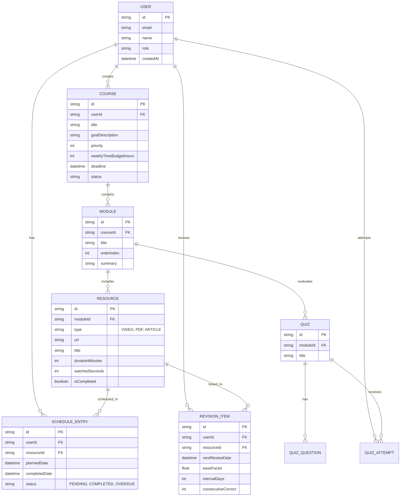
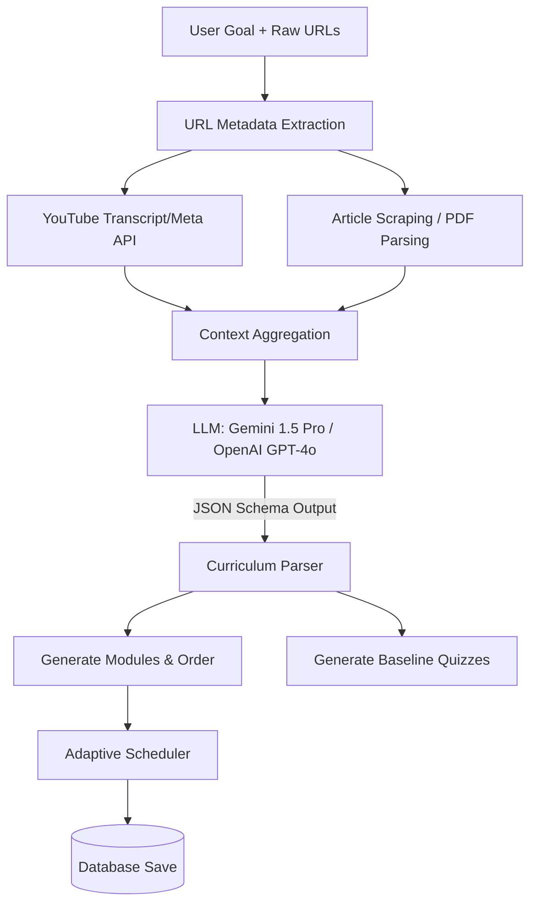
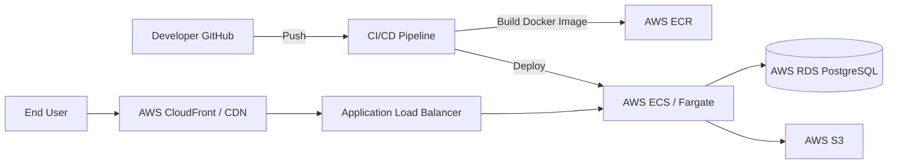
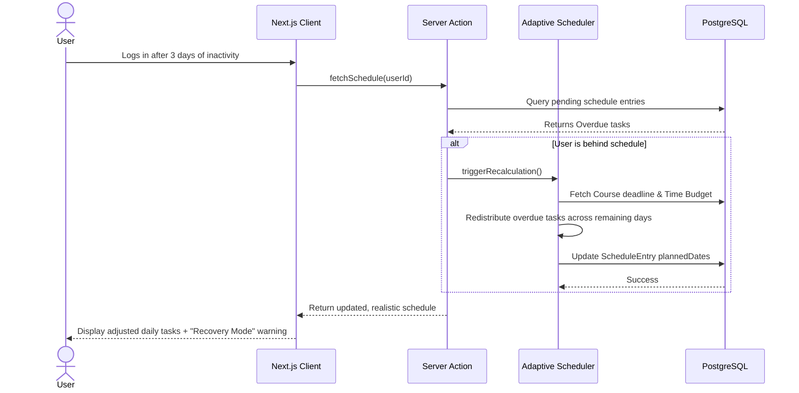

# PathWeaver AI - AI-Powered Adaptive Learning Platform Architecture

## 1. System Overview

> [!NOTE]
> PathWeaver AI acts as a "GPS for learning," transforming scattered educational resources (YouTube, PDFs, articles) into personalized, schedule-aware, and progress-driven learning paths.

### High-Level Architecture Diagram

```mermaid
graph TD
    Client[Web Client (Next.js 15 React)]
    NextJS[Next.js App Router Backend]
    DB[(PostgreSQL)]
    AI[AI Engine - Gemini / OpenAI]
    YT[YouTube Data API v3]
    Storage[AWS S3 / R2 for PDFs]
    
    Client -- Server Actions & REST --> NextJS
    NextJS -- Prisma ORM --> DB
    NextJS -- API Requests --> AI
    NextJS -- Video Meta/Search --> YT
    NextJS -- File Upload/Retrieval --> Storage
    
    subgraph Core Services
        NextJS
        Scheduler[Adaptive Scheduling Engine]
        Progress[Progress Tracking & Analytics]
        Knowledge[Knowledge & Quiz Engine]
    end
    
    NextJS <--> Scheduler
    NextJS <--> Progress
    NextJS <--> Knowledge
```

---

## 2. Complete Folder Structure

The project follows a **Feature-Based Architecture** within the Next.js 15 App Router paradigm, ensuring scalability and separation of concerns.

```text
yt-ai/
├── src/
│   ├── app/                      # Next.js App Router (Pages & Layouts)
│   │   ├── (auth)/               # Auth routes group (login, register)
│   │   ├── (dashboard)/          # Dashboard routes group
│   │   │   ├── layout.tsx
│   │   │   ├── page.tsx          # Main dashboard overview
│   │   │   ├── courses/          # Course management
│   │   │   ├── schedule/         # Unified calendar/schedule
│   │   │   └── analytics/        # Progress tracking
│   │   ├── api/                  # REST endpoints (Webhooks, 3rd party integrations)
│   │   │   ├── auth/[...nextauth]/route.ts
│   │   │   └── webhooks/
│   │   ├── layout.tsx
│   │   └── page.tsx              # Landing page
│   ├── features/                 # Feature modules (Core business logic)
│   │   ├── auth/
│   │   │   ├── actions.ts
│   │   │   ├── components/
│   │   │   └── lib/
│   │   ├── courses/              # Course & Curriculum management
│   │   │   ├── actions.ts        # Server Actions (create, update course)
│   │   │   ├── components/       # Course cards, curriculum viewer
│   │   │   └── types.ts
│   │   ├── learning-engine/      # AI Curriculum & Scheduling
│   │   │   ├── ai-generator.ts   # Integrates Gemini/OpenAI
│   │   │   ├── scheduler.ts      # Adaptive scheduling logic
│   │   │   └── actions.ts
│   │   ├── youtube/              # YouTube Integration
│   │   │   ├── api.ts            # YouTube Data API wrapper
│   │   │   └── components/       # Embedded player with tracking
│   │   └── assessments/          # Quizzes & Spaced Repetition
│   │       ├── actions.ts
│   │       └── components/
│   ├── components/               # Shared UI Components (shadcn/ui + custom)
│   │   ├── ui/                   # Buttons, Inputs, Dialogs
│   │   └── layout/               # Navbars, Sidebars
│   ├── lib/                      # Shared Utilities
│   │   ├── prisma.ts             # Prisma client singleton
│   │   ├── utils.ts
│   │   └── constants.ts
│   └── styles/                   # Tailwind global CSS
├── prisma/
│   ├── schema.prisma             # Database schema
│   └── migrations/
├── docker-compose.yml            # Local DB & services setup
├── Dockerfile                    # Production image definition
├── tailwind.config.ts
└── tsconfig.json
```

---

## 3. Database Schema Design

We use **PostgreSQL** with **Prisma ORM**. The schema is designed to handle complex relationships between user schedules, course resources, and spaced repetition tracking.

### Entity-Relationship Diagram



### Table Definitions

| Table | Core Purpose | Key Fields |
|---|---|---|
| **User** | Authentication & Identity | `id`, `email`, `passwordHash`, `preferences` |
| **Course** | Represents a high-level learning goal | `title`, `priority`, `weeklyTimeBudget`, `deadline` |
| **Module** | Logical breakdown of a course | `courseId`, `title`, `orderIndex` |
| **Resource** | Specific material (YT video, PDF) | `type`, `url`, `durationMinutes`, `isCompleted` |
| **ScheduleEntry** | Maps a resource to a specific time slot | `plannedDate`, `completedDate`, `status` |
| **Quiz** & **QuizQuestion** | AI-generated assessments | `questionText`, `options`, `correctAnswer` |
| **RevisionItem** | Spaced Repetition System (SRS) tracking | `nextReviewDate`, `easeFactor`, `intervalDays` |

---

## 4. API Architecture

PathWeaver AI leverages Next.js 15 Server Actions for most mutations to ensure type safety and seamless frontend-backend integration. REST endpoints (`/api/*`) are reserved for external integrations or specific client-heavy operations.

### Server Actions (Mutations)
- `createCourse(goal: string, resources: string[], deadline: Date)`
- `updateResourceProgress(resourceId: string, watchedSeconds: number, completed: boolean)`
- `rescheduleOverdueItems(userId: string)`
- `submitQuizAttempt(quizId: string, answers: Record<string, string>)`

### REST Endpoints
- `/api/youtube/search`: Proxies requests to YouTube Data API to prevent client-side credential exposure.
- `/api/webhooks/stripe`: (If monetization is added) Subscription updates.
- `/api/auth/[...nextauth]`: NextAuth.js handlers.

---

## 5. AI Engine Architecture

The AI Engine is the core differentiator, responsible for understanding scattered resources and structuring them.



### AI Responsibilities:
1. **Curriculum Generation**: Structuring random YouTube playlists and PDFs into a logical, sequential curriculum.
2. **Quiz Generation**: Reading video transcripts and generating MCQs to test knowledge.
3. **Recovery Planning**: When a user falls behind, AI analyzes the remaining time budget vs deadline and suggests dropping low-priority resources or increasing weekly study hours.

---

## 6. Frontend Component Hierarchy

> [!TIP]
> Use React Server Components (RSC) by default. Add `'use client'` strictly at the lowest possible leaf node (e.g., interactive forms, video players, real-time trackers).

- **`DashboardLayout` (Server)**: Fetches user data, handles navigation sidebar.
  - **`CourseList` (Server)**: Renders list of active courses.
    - **`CourseCard` (Client)**: Interactive hover states, progress rings.
  - **`UnifiedSchedule` (Server)**: Fetches today's tasks.
    - **`ScheduleTimeline` (Client)**: Drag-and-drop to manually adjust the day's plan.
  - **`ActiveLearningView` (Client)**: The actual study interface.
    - **`YouTubePlayerWrapper` (Client)**: Custom wrapper around standard iframe to track watch time via polling or postMessage API.
    - **`NotesEditor` (Client)**: Markdown editor for taking notes alongside the video.

---

## 7. Authentication & Authorization Flow

Using **NextAuth.js (Auth.js v5)**.

- **Providers**: Google OAuth (critical for seamless YouTube integration), Credentials (Email/Password).
- **Session Strategy**: JWT for edge-compatible, stateless authentication.
- **Security**: 
  - Routes protected via Next.js Middleware (`middleware.ts`).
  - Server Actions verify `auth()` session before executing database queries.
  - Row Level Security (RLS) handled at the ORM level (always querying with `where: { userId: session.user.id }`).

---

## 8. State Management Strategy

- **Server State**: Managed natively by Next.js App Router (RSC + Server Actions). Cache invalidation via `revalidatePath` and `revalidateTag`.
- **Client UI State**: React `useState` and `useReducer` for localized state (e.g., modal visibility, form inputs).
- **Complex Client State (Video Tracking)**: Zustand (if needed for cross-component player state, e.g., floating video player while browsing other pages).

---

## 9. Third-Party Integrations

1. **YouTube Data API v3**:
   - `Videos.list`: Fetch duration, title, description.
   - `PlaylistItems.list`: Unroll user-provided playlists into individual resources.
   - `Captions.download`: Fetch transcripts for AI quiz generation (Note: Requires OAuth if private, otherwise use unofficial transcript scrapers for public videos to bypass quota limits where legally permissible).
2. **Gemini API / OpenAI API**: Used for unstructured text processing (Curriculum synthesis, QA generation).
3. **AWS S3**: Storage for user-uploaded PDFs.

---

## 10. Deployment Architecture



- **Containerization**: The Next.js app is dockerized for consistent environments.
- **Hosting**: AWS ECS (Fargate) for scalable compute, or alternatively Vercel for the frontend + AWS RDS for the database depending on budget.
- **Database**: Managed PostgreSQL (AWS RDS or Neon).

---

## 11. Performance Optimization Strategy

- **Next.js Caching**: Heavy use of `fetch` caching for static resources. AI curriculum generation responses are cached where applicable.
- **Database Optimization**:
  - Indexes on `userId`, `status`, and `plannedDate` for fast schedule queries.
  - Prisma query optimization (avoiding N+1 queries using `include`).
- **Video Player**: Lazy load the YouTube iframe (`loading="lazy"`) or use a facade (e.g., `react-lite-youtube-embed`) to prevent main thread blocking on page load.
- **Debouncing**: Video progress tracking pings the server every 30 seconds instead of continuously, using a debounced Server Action.

---

## 12. Security Architecture

> [!CAUTION]
> Protecting user data and preventing abuse of the AI API are critical.

- **API Rate Limiting**: Implement Upstash Redis rate limiting on AI generation routes to prevent billing exhaustion attacks.
- **Data Privacy**: 
  - All DB queries strictly scoped by `userId`.
  - User-uploaded PDFs stored in private S3 buckets, accessed via short-lived Presigned URLs.
- **Cryptography**: (As per skill stack) Passwords hashed with bcrypt/Argon2. Sensitive API keys stored in environment variables (AWS Secrets Manager).
- **Client-Side Security**: Standard Next.js protections (CSP headers, DOM XSS prevention via React, CSRF protection via NextAuth).

---

## 13. Data Flow Diagrams

### Key Journey: Adaptive Scheduling & Recovery


